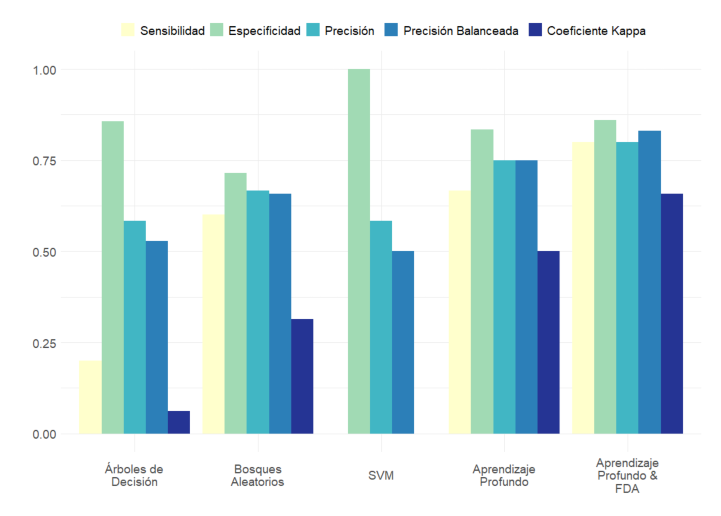

# Statistical Analysis and Automatic Classification of Positron Emission Tomography Data in Alzheimer's Disease

This repository contains all the code used in my Master's Thesis:

Arias-López, J. A. (2023). *Statistical Analysis and Automatic Classification of Positron Emission Tomography Data in Alzheimer's Disease* [Master's thesis, University of Santiago de Compostela]. USC Repository. 

This work explores novel methods for analyzing Positron Emission Tomography (PET) data in patients with Alzheimer's Disease, combining statistical and machine learning approaches to improve diagnostic accuracy and reliability.

The analysis was performed entirely in R, with well-documented scripts to ensure reproducibility. Feel free to use this code to replicate our results or adapt it for your own research. Long live open science!

*Comparison of detection and classification capabilities across different methodological approaches*

